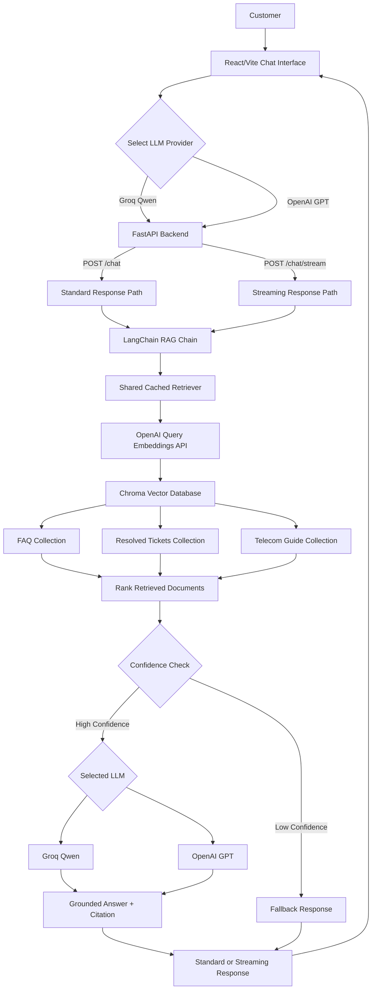

# Telecom RAG Chatbot

A full-stack **Retrieval-Augmented Generation (RAG)** customer-support application for telecom use cases.

The project combines a **React/Vite frontend**, **FastAPI backend**, **LangChain**, **Chroma**, **OpenAI embeddings**, and selectable **Groq Qwen / OpenAI GPT** providers. It retrieves telecom knowledge, checks retrieval relevance, streams grounded answers, and displays source citations.

## Live Demo

**Frontend (React/Vite – Vercel):** [Open live chatbot](https://telecom-rag-chatbot.vercel.app)

**Backend API (FastAPI – Render):** [Open backend](https://telecom-rag-chatbot-poqa.onrender.com)

**API Documentation:** [Interactive Swagger UI](https://telecom-rag-chatbot-poqa.onrender.com/docs)

**Health Check:** [Check backend status](https://telecom-rag-chatbot-poqa.onrender.com/health)

> Note: The backend uses Render's free instance.
> The first request may take longer if the service has been inactive.

------------------------------------------------------------------------

## At a Glance

- **Live application:** [Telecom RAG Chatbot](https://telecom-rag-chatbot.vercel.app)
- **Knowledge sources:** FAQ CSV, resolved-ticket SQLite database, and PDF telecom guide
- **Vector index:** 67 stored vectors across three Chroma collections (25 FAQ, 19 tickets, 23 guide chunks)
- **LLMs:** Runtime choice between Groq-hosted Qwen and OpenAI GPT
- **Evaluation:** Recall@3 = 10/10 on a small, handcrafted resolved-ticket test set (not a production benchmark)
- **Deployment:** Vercel frontend and Render FastAPI backend

------------------------------------------------------------------------

## Demo

### FAQ Retrieval


The assistant retrieves a relevant FAQ and displays the source
separately in the UI.

``` text
Source: FAQ 2
```

### Resolved Ticket Retrieval


The system can retrieve similar previously resolved customer-support
cases.

``` text
Source: Ticket TK-008
```

### Low-Confidence Fallback


When the retrieved context is not sufficiently relevant, the application
skips the LLM and returns a controlled fallback response:

``` text
I don't know based on the available knowledge base. Please call 611 for assistance.
```

No source badge is displayed for fallback responses.

------------------------------------------------------------------------

### Runtime Model Selection

The React interface allows the user to switch between **Groq Qwen** and **OpenAI GPT** at runtime without restarting the backend.

#### Groq Qwen


The request is processed using the Groq-hosted Qwen model while using the same RAG retrieval pipeline and source-citation logic.

#### OpenAI GPT


The same interface can switch to OpenAI GPT while continuing to use the shared telecom knowledge base, confidence check, and citation pipeline.

---
## Key Features

-   Multi-source Retrieval-Augmented Generation
-   FAQ knowledge-base retrieval
-   Resolved support-ticket retrieval
-   Telecom PDF guide retrieval
-   OpenAI `text-embedding-3-small` embeddings
-   Chroma vector database
-   LangChain RAG orchestration
-   Runtime LLM selection between **Groq Qwen** and **OpenAI GPT**
-   Streaming LLM responses
-   Progressive React chat rendering
-   Source-aware answers
-   FAQ, ticket, and guide citations
-   Confidence-based fallback that avoids unnecessary LLM calls
-   Shared cached retriever across LLM providers
-   React source badges
-   Disabled controls during active requests
-   Duplicate-submit protection
-   Friendly API/network error handling
-   FastAPI REST and streaming endpoints
-   React/Vite frontend
-   Retrieval evaluation using Recall@3

------------------------------------------------------------------------

## Architecture



For more detail, see:

``` text
docs/ARCHITECTURE.md
```

------------------------------------------------------------------------

## RAG Flow

``` text
Customer Question
        |
        v
React Frontend
        |
        | question + selected provider
        v
FastAPI
        |
        v
Shared Cached Retriever
        |
        v
Query Embedding
        |
        v
Chroma Retrieval
        |
        +-- FAQ
        +-- Resolved Tickets
        +-- Telecom Guide
        |
        v
Merge + Rank by Distance
        |
        v
Best Retrieved Document
        |
        v
Confidence Check
       / \
      /   \
     v     v
Confident  Low Confidence
   |            |
   v            v
Selected LLM   Fallback
Groq/OpenAI    (no LLM call)
   |
   v
Grounded Answer
   |
   v
Source Citation
   |
   v
Streaming / Standard API Response
   |
   v
React UI
```

------------------------------------------------------------------------

## Knowledge Sources

The chatbot uses three knowledge sources.

### 1. FAQ Knowledge Base

``` text
backend/data/faq.csv
```

Contains frequently asked telecom customer-support questions.

Current collection:

``` text
faq
25 vectors
```

Example citation:

``` text
[FAQ 2]
```

### 2. Resolved Support Tickets

``` text
backend/data/tickets.db
```

Contains previously resolved customer-support cases stored in SQLite.

Current collection:

``` text
tickets
19 vectors
```

Example citation:

``` text
[Ticket TK-008]
```

Resolved-ticket responses are presented as similar previous cases rather
than guaranteed fixes.

### 3. Telecom Technical Guide

``` text
backend/data/telecom_guide.pdf
```

The telecom guide is chunked before embedding.

Current configuration:

``` text
Pages: 9
Chunk size: 1200
Chunk overlap: 250
Chunks: 23
```

Current collection:

``` text
guides
23 vectors
```

Example citation:

``` text
[Guide p. 6]
```

------------------------------------------------------------------------

## Embedding Model

The project uses OpenAI's **`text-embedding-3-small`** for document and query embeddings.

Shared implementation: `backend/embeddings.py`

```python
from langchain_openai import OpenAIEmbeddings

EMBED_MODEL = "text-embedding-3-small"

def get_embeddings():
    """Return the embedding model shared by ingestion and retrieval."""
    return OpenAIEmbeddings(model=EMBED_MODEL)
```

The original implementation used the local Hugging Face model
`sentence-transformers/all-MiniLM-L6-v2`. During the initial Render deployment,
loading SentenceTransformers/PyTorch exceeded the free instance's 512 MB memory
limit. Migrating to OpenAI API-based embeddings reduced backend memory usage and
allowed the service to start successfully.

The same embedding model is used for knowledge-base ingestion and customer-query
retrieval. The retriever is cached and shared by both Groq and OpenAI LLM chains.
**Both provider choices require an OpenAI API key for query embeddings**, even
when Groq generates the final answer. API embedding requests may incur charges.

------------------------------------------------------------------------

## Retrieval Strategy

The application searches the FAQ, ticket, and guide collections and
combines the retrieved candidates.

``` text
Customer Query
       |
       +-- FAQ search
       +-- Ticket search
       +-- Guide search
              |
              v
       Merge candidates
              |
              v
       Sort by distance
              |
              v
       Best document
```

Chroma distance is interpreted as:

``` text
Smaller distance = better semantic match
```

The current RAG chain uses the highest-ranked document as the context
supplied to the selected LLM.

------------------------------------------------------------------------

## Confidence-Based Fallback

The project uses a Chroma distance threshold:

``` text
1.2
```

If:

``` text
best distance <= 1.2
```

the application uses the retrieved document and calls the selected LLM.

If:

``` text
best distance > 1.2
```

the LLM branch is skipped and the application returns:

``` text
I don't know based on the available knowledge base. Please call 611 for assistance.
```

This reduces unsupported answers and avoids an unnecessary LLM call for
low-confidence retrievals.

------------------------------------------------------------------------

## LLM Providers

The user can select the LLM provider directly from the React interface.

### Groq

``` text
Provider: Groq
Model: qwen/qwen3.8-27b
```

### OpenAI

``` text
Provider: OpenAI
Model: gpt-4.1-mini
```

Both providers use the same retrieval pipeline, confidence logic,
grounded prompt, and citation format.

The provider is selected at runtime, so the FastAPI server does not need
to be restarted when switching between Groq and OpenAI.

------------------------------------------------------------------------

## Streaming Responses

The project supports progressive response streaming through:

``` text
POST /chat/stream
```

FastAPI uses `StreamingResponse`, while the React frontend reads the
response with:

``` javascript
const reader = response.body.getReader()
const decoder = new TextDecoder()
```

As chunks arrive, React updates the same assistant message so the answer
appears progressively instead of waiting for the complete response.

When streaming finishes, the frontend separates the trailing citation
from the answer and displays it as a source badge.

The low-confidence fallback remains non-generative and may therefore
appear immediately rather than token-by-token.

------------------------------------------------------------------------

## Source Citations

Supported citation formats include:

``` text
[FAQ 2]
[Ticket TK-008]
[Guide p. 6]
```

The backend includes the citation in the grounded answer. The React
frontend separates it from the answer text and renders it as a badge:

``` text
Source: FAQ 2
```

Fallback and connection-error responses do not display a source badge.

------------------------------------------------------------------------

## Backend API

The backend is implemented with **FastAPI**.

Main application:

``` text
backend/api.py
```

Available endpoints:

``` text
GET  /health
POST /chat
POST /chat/stream
```

### Health Check

``` bash
curl http://127.0.0.1:8000/health
```

Example response:

``` json
{
  "status": "ok"
}
```

### Standard Chat Endpoint

Groq example:

``` bash
curl -X POST http://127.0.0.1:8000/chat \
  -H "Content-Type: application/json" \
  -d '{"question":"How can I activate international roaming?","provider":"groq"}'
```

OpenAI example:

``` bash
curl -X POST http://127.0.0.1:8000/chat \
  -H "Content-Type: application/json" \
  -d '{"question":"How can I activate international roaming?","provider":"openai"}'
```

Example JSON response:

``` json
{
  "answer": "To activate international roaming ... [FAQ 9]"
}
```

### Streaming Chat Endpoint

Groq:

``` bash
curl -N -X POST http://127.0.0.1:8000/chat/stream \
  -H "Content-Type: application/json" \
  -d '{"question":"How can I activate international roaming?","provider":"groq"}'
```

OpenAI:

``` bash
curl -N -X POST http://127.0.0.1:8000/chat/stream \
  -H "Content-Type: application/json" \
  -d '{"question":"How can I activate international roaming?","provider":"openai"}'
```

`curl -N` disables curl output buffering so streamed chunks can be
displayed as they arrive.

------------------------------------------------------------------------

## Frontend

The user interface is built with:

``` text
React
Vite
CSS
```

Main component:

``` text
frontend/src/App.jsx
```

The frontend provides:

-   customer question input
-   conversation history
-   user and assistant message bubbles
-   Groq/OpenAI runtime model selector
-   progressive streamed answers
-   citation badges
-   disabled controls while processing
-   duplicate-submit protection
-   low-confidence fallback responses
-   friendly connection errors
-   responsive layout

During a request, the provider selector, input, and Send button are
disabled to prevent accidental duplicate submissions. The assistant
message is created immediately and progressively updated as streamed
text arrives.

------------------------------------------------------------------------

## Error Handling

If the backend cannot be reached, React displays:

``` text
Sorry, I could not connect to the support service. Please try again.
```

No source badge is displayed for an error response.

The API also validates provider selection and distinguishes
unsupported-provider errors from unexpected server errors.

------------------------------------------------------------------------

## Retrieval Evaluation

The project includes:

``` text
backend/eval_retrieval.py
```

The current evaluation set contains:

``` text
10 handcrafted resolved-ticket queries
```

Metric:

``` text
Recall@3
```

Current result:

``` text
10 / 10
Recall@3 = 100%
```

The expected ticket was retrieved within the top three results for all
current evaluation questions.

> This result describes the current small handcrafted evaluation set and
> should not be interpreted as a production-scale benchmark.

------------------------------------------------------------------------

## Example Queries

### FAQ

``` text
How do I activate 4G/LTE on my phone?
```

Expected source:

``` text
FAQ 3
```

### Resolved Ticket

``` text
My 4G speed is below 1 Mbps in the city centre.
```

Expected source:

``` text
Ticket TK-008
```

### Telecom Guide

``` text
What is SIM swap fraud?
```

Expected source:

``` text
Guide p. 6
```

### International Roaming

``` text
How can I activate international roaming?
```

Expected source:

``` text
FAQ 9
```

### Low-Confidence Query

``` text
How do I bake a chocolate cake?
```

Expected result:

``` text
I don't know based on the available knowledge base. Please call 611 for assistance.
```

------------------------------------------------------------------------

## Project Structure

``` text
telecom-rag-chatbot/
├── backend/
│   ├── __init__.py
│   ├── api.py
│   ├── chroma_store/          # generated locally
│   ├── data/
│   │   ├── faq.csv
│   │   ├── telecom_guide.pdf
│   │   └── tickets.db
│   ├── debug_retrieval.py
│   ├── embeddings.py
│   ├── eval_retrieval.py
│   ├── ingest_faq.py
│   ├── ingest_pdf.py
│   ├── ingest_tickets.py
│   ├── rag_chain.py
│   └── retriever.py
├── docs/
│   ├── ARCHITECTURE.md
│   └── screenshots/
│       ├── 01-faq-response.png
│       ├── 02-ticket-response.png
│       ├── 03-fallback-response.png
│       ├── 04-groq-model-selection.png
│       └── 05-openai-model-selection.png
├── frontend/
│   ├── public/
│   ├── src/
│   │   ├── assets/
│   │   ├── App.css
│   │   ├── App.jsx
│   │   ├── index.css
│   │   └── main.jsx
│   ├── eslint.config.js
│   ├── index.html
│   ├── package-lock.json
│   ├── package.json
│   └── vite.config.js
├── .env.example
├── .gitignore
├── .python-version
├── BUILD_LOG.md
├── README.md
├── pyproject.toml
├── requirements.txt
└── uv.lock
```

Generated/local files such as `.env`, `.venv`, `frontend/node_modules`,
`frontend/dist`, and `backend/chroma_store` are excluded from Git.

------------------------------------------------------------------------

## Local Setup

### 1. Clone the Repository

``` bash
git clone https://github.com/ujoy100/telecom-rag-chatbot.git
cd telecom-rag-chatbot
```

### 2. Create the Python Environment

Install Python dependencies using `uv`:

``` bash
uv sync
```

Activate the environment if required:

``` bash
source .venv/bin/activate
```

### 3. Configure LLM API Keys

Create a local `.env` file:

``` bash
cp .env.example .env
```

Add the provider keys you intend to use:

``` env
LLM_PROVIDER=groq
GROQ_API_KEY=your_groq_api_key_here
OPENAI_API_KEY=your_openai_api_key_here
```

Never commit the real `.env` file.

`LLM_PROVIDER` provides a default/fallback provider for the backend. The
React interface sends the selected provider with each chat request.

### 4. Build the Vector Knowledge Base

``` bash
uv run python -m backend.ingest_faq
uv run python -m backend.ingest_tickets
uv run python -m backend.ingest_pdf
```

Run these commands from the repository root with `OPENAI_API_KEY` configured. This generates the local Chroma vector database.

### 5. Start the FastAPI Backend

From the project root:

``` bash
uv run uvicorn backend.api:app
```

Backend:

``` text
http://127.0.0.1:8000
```

Swagger API documentation:

``` text
http://127.0.0.1:8000/docs
```

### 6. Start the React Frontend

Open another terminal:

``` bash
cd frontend
npm install
npm run dev
```

Frontend:

``` text
http://localhost:5173
```

------------------------------------------------------------------------

## Production Deployment (Render + Vercel)

The frontend and backend are deployed independently:

```text
Browser → Vercel (React/Vite) → Render (FastAPI)
                                ↓
                    OpenAI query embeddings
                                ↓
                    Chroma FAQ / tickets / guide
                                ↓
                    Relevance check and fallback
                                ↓
                    Groq Qwen or OpenAI GPT
                                ↓
                    Streamed answer + source badge
```

### Render backend

Connect the GitHub repository to a **Render Web Service**. Configure the
repository root as the working directory so Python package imports resolve.

**Build command** (installs dependencies and rebuilds Chroma collections):

```bash
uv sync --frozen && uv run python -m backend.ingest_faq && uv run python -m backend.ingest_tickets && uv run python -m backend.ingest_pdf
```

**Start command**:

```bash
uv run uvicorn backend.api:app --host 0.0.0.0 --port $PORT
```

Configure these Render environment variables:

| Variable | Purpose |
| --- | --- |
| `OPENAI_API_KEY` | Query/document embeddings and OpenAI LLM calls |
| `GROQ_API_KEY` | Groq-hosted LLM calls |
| `LLM_PROVIDER` | Default LLM provider |
| `FRONTEND_URL` | Allowed Vercel frontend origin for FastAPI CORS |

Set `FRONTEND_URL=https://telecom-rag-chatbot.vercel.app`.
Never commit secret API keys or place them in browser-side configuration.

### Vercel frontend

Import the same GitHub repository into Vercel as a **single frontend project**.
Set **Root Directory** to `frontend` and **Framework Preset** to `Vite`.

Configure this Vercel environment variable:

```env
VITE_API_BASE_URL=https://telecom-rag-chatbot-poqa.onrender.com
```

`frontend/src/App.jsx` reads `import.meta.env.VITE_API_BASE_URL` to choose the
backend API. Only the public Render URL belongs in this variable; **do not**
put OpenAI or Groq keys in any `VITE_` variable.

### Production verification

```bash
curl https://telecom-rag-chatbot-poqa.onrender.com/health

curl -N -X POST https://telecom-rag-chatbot-poqa.onrender.com/chat/stream \
  -H "Content-Type: application/json" \
  -d '{"question":"How can I activate international roaming?","provider":"groq"}'

curl -N -X POST https://telecom-rag-chatbot-poqa.onrender.com/chat/stream \
  -H "Content-Type: application/json" \
  -d '{"question":"How can I activate international roaming?","provider":"openai"}'
```

The live Vercel frontend was tested with Groq and OpenAI, and both returned
an international-roaming answer with **Source: FAQ 9**. The out-of-scope
fallback was also tested. Render's free instance may take time to wake after
inactivity.

### Deployment lessons learned

The first Render startup exceeded 512 MB because the local Hugging Face model
loaded PyTorch. Switching to OpenAI embeddings fixed the memory problem.
A subsequent build encountered `ModuleNotFoundError: No module named 'backend'`
when ingestion scripts were run by file path. Running them as package modules
(`python -m backend.ingest_faq`, etc.) fixed that import issue.

------------------------------------------------------------------------

## Development Flow

Use two terminals during local development.

Terminal 1:

``` bash
cd /path/to/telecom-rag-chatbot
uv run uvicorn backend.api:app
```

Terminal 2:

``` bash
cd /path/to/telecom-rag-chatbot/frontend
npm run dev
```

Then open:

``` text
http://localhost:5173
```

------------------------------------------------------------------------

## Validation

### Backend Syntax Check

``` bash
python -m py_compile backend/rag_chain.py backend/api.py
```

### Frontend Lint

``` bash
cd frontend
npm run lint
```

### Frontend Production Build

``` bash
npm run build
```

The production frontend is generated under:

``` text
frontend/dist/
```

------------------------------------------------------------------------

## Technology Stack

| Layer | Technology |
| --- | --- |
| Frontend | React, Vite, CSS |
| Frontend linting | ESLint |
| Backend | FastAPI |
| Streaming | FastAPI `StreamingResponse`, Fetch Streams API |
| RAG orchestration | LangChain |
| Vector database | Chroma |
| Embeddings | OpenAI Embeddings API — `text-embedding-3-small` |
| LLM providers | Groq Qwen (`qwen/qwen3.8-27b`), OpenAI (`gpt-4.1-mini`) |
| Ticket data | SQLite |
| PDF processing | PyPDF |
| Python dependency management | uv |
| Frontend package management | npm |
| Frontend hosting | Vercel |
| Backend hosting | Render |
| Version control | Git and GitHub |

------------------------------------------------------------------------

## What This Project Demonstrates

This project demonstrates practical implementation of:

-   end-to-end RAG architecture
-   multi-source retrieval
-   vector search and semantic embeddings
-   retrieval confidence handling
-   hallucination reduction through fallback logic
-   prompt grounding and source attribution
-   multi-provider LLM integration
-   runtime provider selection
-   streamed LLM responses
-   React stream consumption and progressive rendering
-   FastAPI REST/streaming API design
-   React/FastAPI integration
-   retriever reuse/caching
-   frontend asynchronous state management
-   retrieval evaluation
-   secure API-key management
-   reproducible project organization
-   cloud deployment and environment configuration across Render and Vercel
-   memory-aware embedding architecture and debugging deployment failures

------------------------------------------------------------------------

## Future Improvements

Potential improvements include:

-   reranking retrieved documents
-   hybrid lexical + vector search
-   structured citation metadata from the backend
-   conversation memory
-   automated evaluation with larger datasets
-   authentication and rate limiting
-   Docker deployment
-   deployment monitoring and automated health checks
-   observability and tracing
-   automated tests and CI/CD

------------------------------------------------------------------------

## Documentation

Detailed architecture:

``` text
docs/ARCHITECTURE.md
```

Development history:

``` text
BUILD_LOG.md
```

------------------------------------------------------------------------

## Status

The current portfolio version includes:

``` text
Multi-source retrieval           ✅
Confidence fallback              ✅
Source citations                 ✅
Retrieval evaluation             ✅
FastAPI backend                  ✅
React/Vite frontend              ✅
Groq Qwen provider               ✅
OpenAI GPT provider              ✅
Runtime model selector           ✅
Standard /chat endpoint          ✅
Streaming /chat/stream endpoint  ✅
Progressive React streaming      ✅
Shared cached retriever          ✅
Source badges                    ✅
Error handling                   ✅
Architecture documentation       ✅
Portfolio screenshots            ✅
Render backend deployment        ✅
Vercel frontend deployment       ✅
OpenAI embedding migration        ✅
Live browser tests                ✅
```
