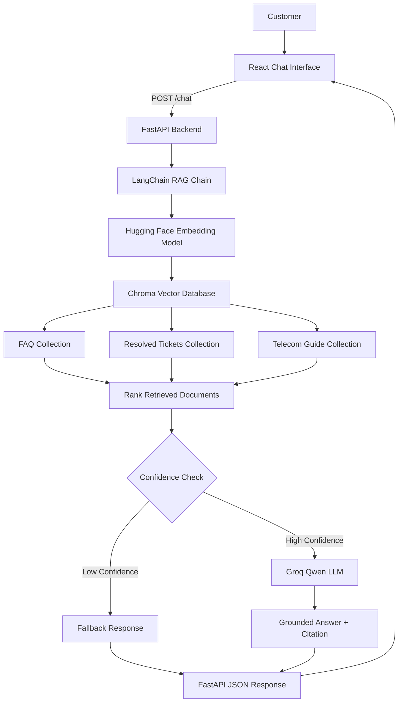

# Telecom RAG Chatbot

A full-stack **Retrieval-Augmented Generation (RAG)** customer-support application for telecom use cases.

The project combines a **React frontend**, **FastAPI backend**, **LangChain**, **Chroma**, **Hugging Face embeddings**, and a **Groq-hosted Qwen LLM** to answer telecom questions using multiple knowledge sources while providing source citations and confidence-based fallback behavior.

---

## Demo

### FAQ Retrieval


The assistant retrieves a relevant FAQ and displays the source separately in the UI.

Example:

```text
Source: FAQ 2
```

---

### Resolved Ticket Retrieval


The system can retrieve similar previously resolved customer-support cases.

Example:

```text
Source: Ticket TK-008
```

---

### Low-Confidence Fallback


When the retrieved context is not sufficiently relevant, the application avoids generating an unsupported answer.

Example:

```text
I don't know based on the available knowledge base.
Please call 611 for assistance.
```

No source badge is displayed for fallback responses.

---

# Key Features

- Multi-source Retrieval-Augmented Generation
- FAQ knowledge-base retrieval
- Resolved support-ticket retrieval
- Telecom PDF guide retrieval
- Hugging Face sentence embeddings
- Chroma vector database
- LangChain RAG orchestration
- Groq-hosted Qwen LLM
- Source-aware answers
- FAQ, ticket, and guide citations
- Confidence-based fallback logic
- React source badges
- Loading indicator
- Disabled controls during requests
- Duplicate-submit protection
- Friendly API/network error handling
- FastAPI REST backend
- React/Vite frontend
- Retrieval evaluation using Recall@3

---

# Architecture



For more detail, see:

```text
docs/ARCHITECTURE.md
```

---

# RAG Flow

```text
Customer Question
        │
        ▼
React Frontend
        │
        │ POST /chat
        ▼
FastAPI Backend
        │
        ▼
LangChain RAG Chain
        │
        ▼
Query Embedding
        │
        ▼
Chroma Retrieval
        │
        ├── FAQ
        ├── Resolved Tickets
        └── Telecom Guide
        │
        ▼
Rank Results by Distance
        │
        ▼
Best Retrieved Document
        │
        ▼
Confidence Check
       / \
      /   \
Confident  Low Confidence
    │            │
    ▼            ▼
Groq Qwen      Fallback
    │
    ▼
Grounded Answer
    │
    ▼
Source Citation
        │
        ▼
React UI
```

---

# Knowledge Sources

The chatbot currently uses three knowledge sources.

## 1. FAQ Knowledge Base

```text
backend/data/faq.csv
```

Contains frequently asked telecom customer-support questions.

Current collection:

```text
faq
25 vectors
```

Example citation:

```text
[FAQ 2]
```

---

## 2. Resolved Support Tickets

```text
backend/data/tickets.db
```

Contains previously resolved customer-support cases stored in SQLite.

Current collection:

```text
tickets
19 vectors
```

Example citation:

```text
[Ticket TK-008]
```

Resolved-ticket responses are presented as similar previous cases rather than guaranteed fixes.

---

## 3. Telecom Technical Guide

```text
backend/data/telecom_guide.pdf
```

The telecom guide is chunked before embedding.

Current configuration:

```text
Pages: 9
Chunk size: 1200
Chunk overlap: 250
Chunks: 23
```

Current collection:

```text
guides
23 vectors
```

Example citation:

```text
[Guide p. 6]
```

---

# Embedding Model

The project uses:

```text
sentence-transformers/all-MiniLM-L6-v2
```

The same embedding model is used for:

```text
Knowledge-base ingestion
        +
Customer query embedding
```

This allows semantic similarity search across the Chroma collections.

---

# Retrieval Strategy

The application searches:

```text
FAQ
Tickets
Guide
```

and combines the retrieved candidates.

Conceptually:

```text
Customer Query
       │
       ├── FAQ search
       ├── Ticket search
       └── Guide search
              │
              ▼
       Merge candidates
              │
              ▼
       Sort by distance
              │
              ▼
       Best document
```

Chroma distance is interpreted as:

```text
Smaller distance = better semantic match
```

The current RAG chain uses the highest-ranked document as the context supplied to the LLM.

---

# Confidence-Based Fallback

The project uses a Chroma distance threshold:

```text
1.2
```

If:

```text
best distance <= 1.2
```

the application uses the retrieved document and calls the LLM.

If:

```text
best distance > 1.2
```

the normal answer-generation branch is skipped.

The application returns:

```text
I don't know based on the available knowledge base.
Please call 611 for assistance.
```

This reduces unsupported answers when retrieval confidence is low.

---

# LLM

Provider:

```text
Groq
```

Current model:

```text
qwen/qwen3.8-27b
```

The LLM receives retrieved telecom context and generates a concise customer-support answer grounded in that source.

---

# Source Citations

Supported citation formats include:

```text
[FAQ 2]

[Ticket TK-008]

[Guide p. 6]
```

The backend returns the citation with the answer.

The React frontend separates the citation from the answer text and renders it as a badge:

```text
Source: FAQ 2
```

Fallback and error responses do not display a source badge.

---

# Backend API

The backend is implemented with **FastAPI**.

Main application:

```text
backend/api.py
```

Available endpoints:

```text
GET  /health
POST /chat
```

---

## Health Check

Request:

```bash
curl http://127.0.0.1:8000/health
```

Response:

```json
{
  "status": "ok"
}
```

---

## Chat Endpoint

Request:

```bash
curl -X POST http://127.0.0.1:8000/chat \
  -H "Content-Type: application/json" \
  -d '{"question":"What is SIM swap fraud?"}'
```

Example response:

```json
{
  "answer": "SIM swap fraud occurs when ... [Guide p. 6]"
}
```

---

# Frontend

The user interface is built with:

```text
React
Vite
CSS
```

Main component:

```text
frontend/src/App.jsx
```

The frontend provides:

- customer question input
- conversation history
- user message bubbles
- assistant message bubbles
- citation badges
- loading feedback
- disabled controls while processing
- fallback responses
- friendly connection errors

---

# Loading State

While waiting for FastAPI, the interface displays:

```text
Telecom Assistant
Thinking...
```

The Send button changes to:

```text
Waiting...
```

and the input is temporarily disabled.

This also prevents accidental duplicate submissions.

---

# Error Handling

If the backend cannot be reached, React displays:

```text
Sorry, I could not connect to the support service.
Please try again.
```

No source badge is displayed for an error response.

---

# Retrieval Evaluation

The project includes:

```text
backend/eval_retrieval.py
```

The current evaluation set contains:

```text
10 handcrafted resolved-ticket queries
```

Metric:

```text
Recall@3
```

Current result:

```text
10 / 10
Recall@3 = 100%
```

The expected ticket was retrieved within the top three results for all current evaluation questions.

> This result describes the current small handcrafted evaluation set and should not be interpreted as a production-scale benchmark.

---

# Example Queries

### FAQ

```text
How do I activate 4G/LTE on my phone?
```

Expected source:

```text
FAQ 3
```

---

### Resolved Ticket

```text
My 4G speed is below 1 Mbps in the city centre.
```

Expected source:

```text
Ticket TK-008
```

---

### Telecom Guide

```text
What is SIM swap fraud?
```

Expected source:

```text
Guide p. 6
```

---

### Low-Confidence Query

```text
How do I bake a chocolate cake?
```

Expected result:

```text
I don't know based on the available knowledge base.
Please call 611 for assistance.
```

---

# Project Structure

```text
telecom-rag-chatbot/
├── backend/
│   ├── __init__.py
│   ├── api.py
│   ├── chroma_store/          # generated locally
│   ├── data/
│   │   ├── faq.csv
│   │   ├── telecom_guide.pdf
│   │   └── tickets.db
│   ├── debug_retrieval.py
│   ├── eval_retrieval.py
│   ├── ingest_faq.py
│   ├── ingest_pdf.py
│   ├── ingest_tickets.py
│   ├── rag_chain.py
│   └── retriever.py
├── docs/
│   ├── ARCHITECTURE.md
│   └── screenshots/
│       ├── 01-faq-response.png
│       ├── 02-ticket-response.png
│       └── 03-fallback-response.png
├── frontend/
│   ├── public/
│   ├── src/
│   │   ├── assets/
│   │   ├── App.css
│   │   ├── App.jsx
│   │   ├── index.css
│   │   └── main.jsx
│   ├── eslint.config.js
│   ├── index.html
│   ├── package-lock.json
│   ├── package.json
│   └── vite.config.js
├── .env.example
├── .gitignore
├── .python-version
├── BUILD_LOG.md
├── README.md
├── pyproject.toml
├── requirements.txt
└── uv.lock
```

Generated/local files such as `.env`, `.venv`, `node_modules`, and `chroma_store` are excluded from Git.

---

# Local Setup

## 1. Clone the Repository

```bash
git clone <your-repository-url>
cd telecom-rag-chatbot
```

---

## 2. Create the Python Environment

Install dependencies using `uv`:

```bash
uv sync
```

Activate the environment if required:

```bash
source .venv/bin/activate
```

---

## 3. Configure the Groq API Key

Create a local `.env` file from the example:

```bash
cp .env.example .env
```

Then add your Groq API key:

```env
GROQ_API_KEY=your_groq_api_key_here
```

Never commit the real `.env` file.

---

## 4. Build the Vector Knowledge Base

Run:

```bash
python backend/ingest_faq.py
```

Then:

```bash
python backend/ingest_tickets.py
```

Then:

```bash
python backend/ingest_pdf.py
```

This generates the local Chroma vector database.

---

## 5. Start the FastAPI Backend

From the project root:

```bash
uv run uvicorn backend.api:app --reload
```

Backend:

```text
http://127.0.0.1:8000
```

Swagger API documentation:

```text
http://127.0.0.1:8000/docs
```

---

## 6. Start the React Frontend

Open another terminal:

```bash
cd frontend
npm install
npm run dev
```

Frontend:

```text
http://localhost:5173
```

---

# Development Flow

For local development, use two terminals.

Terminal 1:

```bash
uv run uvicorn backend.api:app --reload
```

Terminal 2:

```bash
cd frontend
npm run dev
```

Then open:

```text
http://localhost:5173
```

---

# Technology Stack

| Layer | Technology |
|---|---|
| Frontend | React |
| Build Tool | Vite |
| Frontend Linting | ESLint |
| Backend | FastAPI |
| RAG Framework | LangChain |
| Vector Database | Chroma |
| Embeddings | Hugging Face Sentence Transformers |
| Embedding Model | `all-MiniLM-L6-v2` |
| LLM Provider | Groq |
| LLM | Qwen 3.8 27B |
| Ticket Database | SQLite |
| PDF Processing | PyPDF |
| Python Package Manager | uv |
| Frontend Package Manager | npm |
| Version Control | Git / GitHub |

---

# What This Project Demonstrates

This project demonstrates practical implementation of:

- end-to-end RAG architecture
- multi-source retrieval
- vector search
- semantic embeddings
- retrieval confidence handling
- hallucination reduction through fallback logic
- prompt grounding
- source attribution
- REST API design
- React/FastAPI integration
- frontend asynchronous request handling
- retrieval evaluation
- secure API-key management
- reproducible project organization

---

# Future Improvements

Potential improvements include:

- reranking retrieved documents
- hybrid lexical + vector search
- structured citation metadata from the backend
- conversation memory
- automated evaluation with larger datasets
- authentication and rate limiting
- Docker deployment
- cloud deployment
- observability and tracing
- automated tests and CI/CD

---

# Documentation

Detailed architecture:

```text
docs/ARCHITECTURE.md
```

Development history:

```text
BUILD_LOG.md
```

---

# Status

The current portfolio version includes:

```text
Multi-source retrieval      ✅
Confidence fallback         ✅
Source citations            ✅
Retrieval evaluation        ✅
FastAPI backend             ✅
React frontend              ✅
Source badges               ✅
Loading state               ✅
Error handling              ✅
Architecture documentation  ✅
Portfolio screenshots       ✅
```
