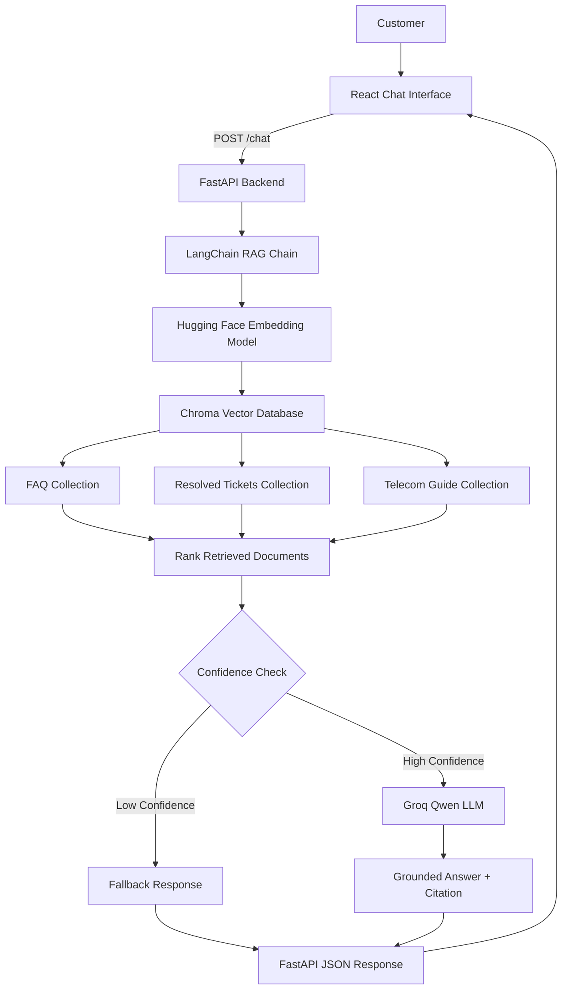

# Telecom RAG Chatbot — Architecture

## Overview

The Telecom RAG Chatbot is a full-stack Retrieval-Augmented Generation (RAG) application for telecom customer support.

The system combines:

- React frontend
- FastAPI backend
- LangChain RAG orchestration
- Chroma vector database
- Hugging Face embeddings
- Groq-hosted Qwen LLM
- FAQ knowledge base
- Resolved support tickets
- Telecom technical guide
- Confidence-based fallback logic
- Source-aware answers and UI citation badges

---

# High-Level Architecture



---

# Request Flow

A normal customer question follows this path:

```text
Customer Question
        │
        ▼
React Frontend
        │
        │ POST /chat
        ▼
FastAPI Backend
        │
        ▼
LangChain RAG Chain
        │
        ▼
Query Embedding
        │
        ▼
Chroma Retrieval
        │
        ▼
Best Matching Document
        │
        ▼
Confidence Threshold
       / \
      /   \
Confident  Low Confidence
    │            │
    ▼            ▼
Groq Qwen      Fallback
    │
    ▼
Grounded Answer
    │
    ▼
Source Citation
        │
        ▼
FastAPI JSON Response
        │
        ▼
React Chat Interface
```

---

# Knowledge Sources

The RAG system searches three Chroma collections.

## FAQ Collection

Source:

```text
backend/data/faq.csv
```

Contains frequently asked telecom customer-support questions.

Example citation:

```text
[FAQ 2]
```

---

## Resolved Tickets Collection

Source:

```text
backend/data/tickets.db
```

Contains previously resolved customer-support cases.

Example citation:

```text
[Ticket TK-008]
```

Ticket answers are presented as similar previously resolved cases rather than guaranteed solutions.

---

## Telecom Guide Collection

Source:

```text
backend/data/telecom_guide.pdf
```

Contains technical telecom reference information.

The PDF is split into chunks before embedding.

Current chunk configuration:

```text
Chunk size: 1200
Chunk overlap: 250
```

Example citation:

```text
[Guide p. 6]
```

---

# Embeddings

Embedding model:

```text
sentence-transformers/all-MiniLM-L6-v2
```

The same embedding model is used during:

```text
Document ingestion
        +
Customer query embedding
```

This allows Chroma to compare the customer question with the stored knowledge-base vectors.

---

# Vector Database

Vector database:

```text
Chroma
```

Collections:

```text
faq
tickets
guides
```

Current stored vectors:

```text
FAQ       → 25 vectors
Tickets   → 19 vectors
Guide     → 23 vectors
```

---

# Retrieval

The retriever searches all three collections and merges the candidate results.

Conceptually:

```text
Customer Query
       │
       ├── FAQ search
       ├── Ticket search
       └── Guide search
             │
             ▼
      Merge candidates
             │
             ▼
      Sort by distance
             │
             ▼
      Best document
```

Chroma returns distance scores.

```text
Smaller distance = better semantic match
```

The RAG chain currently uses the highest-ranked document as the final context passed to the LLM. This helps reduce unrelated context mixing.

---

# Confidence / Fallback Logic

The current distance threshold is:

```text
1.2
```

Decision:

```text
Best distance <= 1.2
        │
        ▼
Use retrieved context
        │
        ▼
Call Groq LLM
```

Otherwise:

```text
Best distance > 1.2
        │
        ▼
Skip normal LLM answer branch
        │
        ▼
Return fallback
```

Fallback response:

```text
I don't know based on the available knowledge base.
Please call 611 for assistance.
```

This prevents unrelated questions from being answered with weak or misleading context.

---

# LLM

Provider:

```text
Groq
```

Current model:

```text
qwen/qwen3.8-27b
```

The model is used only when retrieval confidence is sufficient.

The LLM receives the highest-ranked relevant document and generates a concise customer-support answer grounded in that source.

---

# Source Citations

The backend generates source-aware citations.

Supported formats:

```text
[FAQ 2]
[Ticket TK-008]
[Guide p. 6]
```

React separates the citation from the answer text and displays it as a source badge.

Example:

```text
Slow speeds can be caused by network congestion...

Source: FAQ 2
```

The frontend supports FAQ, resolved-ticket, and guide citations.

Low-confidence fallback responses and connection-error messages do not display a source badge.

---

# FastAPI Backend

Backend entry point:

```text
backend/api.py
```

Endpoints:

```text
GET /health
POST /chat
```

Health response:

```json
{
  "status": "ok"
}
```

Chat request:

```json
{
  "question": "Why is my mobile internet so slow?"
}
```

Chat response:

```json
{
  "answer": "..."
}
```

The API initializes the RAG chain once when the backend starts.

Development CORS is configured for:

```text
http://localhost:5173
http://127.0.0.1:5173
```

---

# React Frontend

Frontend:

```text
frontend/
```

Main component:

```text
frontend/src/App.jsx
```

Main styling:

```text
frontend/src/App.css
frontend/src/index.css
```

The frontend provides:

- customer message input
- chat history
- user message bubbles
- assistant message bubbles
- RAG source badges
- loading indicator
- disabled controls while processing
- duplicate-submit protection
- friendly connection-error messages
- low-confidence fallback display

---

# Loading State

When a request is in progress, React sets:

```text
isLoading = true
```

The UI then displays:

```text
Telecom Assistant
Thinking...
```

The input placeholder becomes:

```text
Waiting for response...
```

and the Send button becomes:

```text
Waiting...
```

The input and button are temporarily disabled until the request finishes.

---

# Error Handling

If FastAPI cannot be reached, React displays:

```text
Sorry, I could not connect to the support service.
Please try again.
```

The request uses a `try / catch / finally` flow:

```text
try
  → call FastAPI and process response

catch
  → show friendly error message

finally
  → clear loading state
```

No source badge is displayed for an error message.

---

# Retrieval Evaluation

The project includes:

```text
backend/eval_retrieval.py
```

Evaluation uses 10 handcrafted ticket queries.

Metric:

```text
Recall@3
```

Current result:

```text
10/10
Recall@3 = 100%
```

This means the expected resolved ticket appeared within the top three retrieval results for every current evaluation query.

---

# Example End-to-End Scenarios

## FAQ Example

Question:

```text
Why is my mobile internet so slow?
```

Expected source:

```text
FAQ 2
```

UI:

```text
Assistant answer...

Source: FAQ 2
```

---

## Resolved Ticket Example

Question:

```text
My 4G speed is below 1 Mbps in the city centre.
```

Expected source:

```text
Ticket TK-008
```

UI:

```text
In a similar previously resolved case...

Source: Ticket TK-008
```

---

## Guide Example

Question:

```text
What is SIM swap fraud?
```

Expected source:

```text
Guide p. 6
```

UI:

```text
SIM swap fraud occurs when...

Source: Guide p. 6
```

---

## Low-Confidence Example

Question:

```text
How do I bake a chocolate cake?
```

Result:

```text
I don't know based on the available knowledge base.
Please call 611 for assistance.
```

Source badge:

```text
None
```

---

# Project Structure

```text
telecom-rag-chatbot/
├── backend/
│   ├── __init__.py
│   ├── api.py
│   ├── chroma_store/
│   ├── data/
│   │   ├── faq.csv
│   │   ├── telecom_guide.pdf
│   │   └── tickets.db
│   ├── debug_retrieval.py
│   ├── eval_retrieval.py
│   ├── ingest_faq.py
│   ├── ingest_pdf.py
│   ├── ingest_tickets.py
│   ├── rag_chain.py
│   └── retriever.py
├── docs/
│   └── ARCHITECTURE.md
├── frontend/
│   ├── public/
│   ├── src/
│   │   ├── assets/
│   │   ├── App.css
│   │   ├── App.jsx
│   │   ├── index.css
│   │   └── main.jsx
│   ├── eslint.config.js
│   ├── index.html
│   ├── package-lock.json
│   ├── package.json
│   └── vite.config.js
├── .env
├── .env.example
├── .gitignore
├── .python-version
├── BUILD_LOG.md
├── README.md
├── main.py
├── pyproject.toml
├── requirements.txt
└── uv.lock
```

---

# Technology Stack

| Layer | Technology |
|---|---|
| Frontend | React |
| Frontend build tool | Vite |
| Frontend linter | ESLint |
| Backend API | FastAPI |
| RAG framework | LangChain |
| Vector database | Chroma |
| Embeddings | Hugging Face Sentence Transformers |
| Embedding model | `all-MiniLM-L6-v2` |
| LLM provider | Groq |
| LLM | Qwen 3.8 27B |
| PDF ingestion | PyPDF |
| Ticket storage | SQLite |
| Python package manager | uv |
| Frontend package manager | npm |
| Version control | Git / GitHub |

---

# Final Application Flow

```text
React
  │
  ▼
FastAPI
  │
  ▼
LangChain
  │
  ▼
Chroma
  │
  ├── FAQ
  ├── Tickets
  └── Guide
  │
  ▼
Confidence Check
  │
  ├── Groq Qwen
  │      │
  │      ▼
  │   Answer + Source
  │
  └── Fallback
         │
         ▼
       React
```

---

# Current Status

Completed capabilities:

```text
Multi-source RAG retrieval       ✅
FAQ retrieval                    ✅
Ticket retrieval                 ✅
PDF guide retrieval              ✅
Confidence fallback              ✅
Source citations                 ✅
Recall@3 evaluation              ✅
FastAPI backend                  ✅
React frontend                   ✅
React → FastAPI integration      ✅
Source badges                    ✅
Fallback UI                      ✅
Loading state                    ✅
Friendly API error handling      ✅
```

The next portfolio step is to capture clean screenshots and use this architecture document together with the project README for interview presentation.
